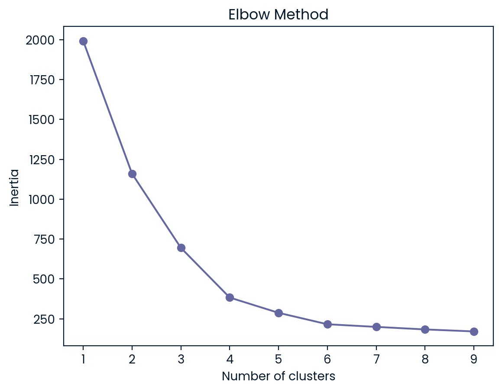
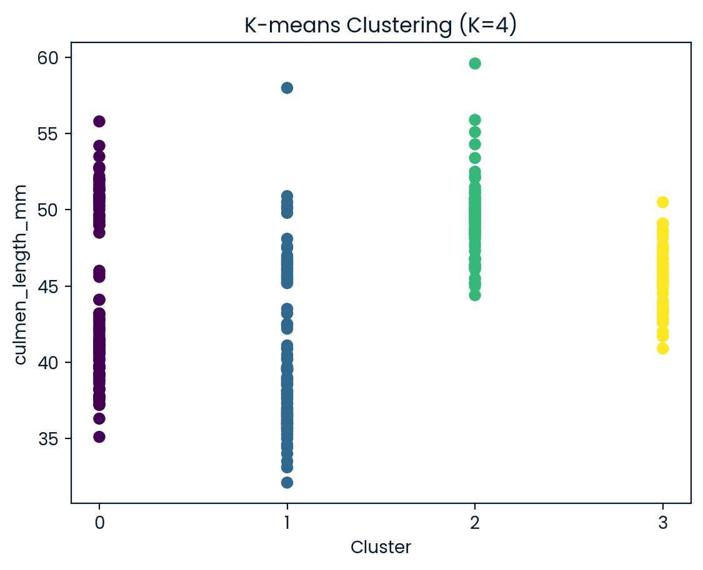

## 🐧 Penguin Clustering Project

In this project, we applied **K-Means Clustering** to group penguins in Antarctica based on their physical characteristics.  
The goal was to discover natural clusters using features like culmen length, flipper length, and body mass, since species labels were not provided.

## Dataset
- **File:** `penguins.csv`
- **Features:**
  - `culmen_length_mm`
  - `culmen_depth_mm`
  - `flipper_length_mm`
  - `body_mass_g`
  - `sex`

## 🚀 What We Did
1. Loaded and preprocessed the data (dummy variables & scaling).
2. Identified the optimal number of clusters using the **Elbow Method**.
3. Applied **K-Means clustering** to assign cluster labels.
4. Visualized the clusters for analysis.
5. Created a summary of average measurements for each cluster (`stat_penguins` DataFrame).

## 📊 Results
The final output shows the mean values for each cluster, helping researchers distinguish between different groups of penguins based on size and proportions.

## 🛠️ Tech Stack
- Python
- Pandas
- Matplotlib
- Scikit-learn

## 🙏 Acknowledgment

This project was created as part of a DataCamp course to practice data analysis and data manipulation techniques using Python.  
The dataset originates from Dr. Kristen Gorman and the Palmer Station, Antarctica LTER, a member of the Long Term Ecological Research Network (LTER).  
Special thanks to DataCamp for providing the learning resources and exercises that guided this project.

mdkhademali